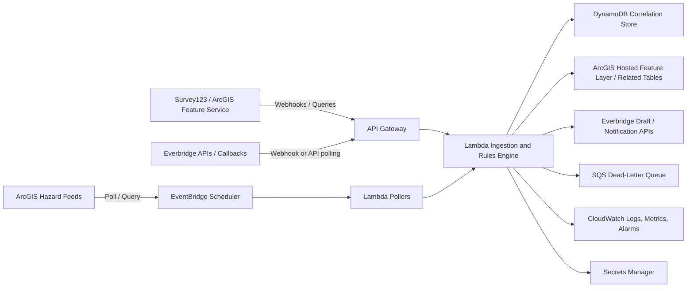

# AWS Integration Architecture for ArcGIS and Everbridge

## Objective

Provide a secure and auditable integration layer that:

- Ingests aggregate Everbridge notification results into ArcGIS
- Consumes ArcGIS webhooks and feature changes
- Applies business rules and deduplication
- Creates Everbridge drafts or operator actions under controlled conditions
- Avoids direct client-side coupling between Survey123, dashboards, and Everbridge

## Architectural Principles

- ArcGIS remains the authoritative operational picture.
- Everbridge remains the authoritative communications platform.
- The integration service owns correlation, transformation, and automation logic.
- Aggregate data only should flow back to ArcGIS from Everbridge.
- All credentials must be server-side and centrally managed.
- Outbound notification launch should require human approval until explicitly authorized.

## Target Architecture

## Core Components

### API Gateway

Responsibilities:

- Receive ArcGIS webhook events.
- Receive Everbridge callbacks if supported.
- Expose a controlled HTTPS endpoint for external integrations.
- Enforce TLS, request size limits, and authentication validation.

Recommended controls:

- Custom authorizer or signed secret validation.
- Rate limiting.
- Separate routes for ArcGIS inbound and Everbridge inbound traffic.

### Lambda Ingestion and Rules Engine

Responsibilities:

- Validate source authenticity.
- Normalize inbound payloads.
- Resolve event and district correlation.
- Compute material-change hashes.
- Decide whether to write to ArcGIS, create Everbridge drafts, ignore the event, or raise an operator alert.
- Record audit details for every decision.

Suggested functions:

- `arcgisWebhookHandler`
- `everbridgeCallbackHandler`
- `everbridgePoller`
- `hazardFeedPoller`
- `rulesEvaluator`
- `arcgisWriter`
- `everbridgeDraftCreator`

### DynamoDB Correlation Store

Purpose:

- Track event correlation across systems.
- Prevent duplicate notification generation.
- Prevent feedback loops.
- Record last processed versions and hashes.

Suggested entities:

- `EventCorrelation`
- `NotificationState`
- `ProcessingLedger`
- `FeedDedupState`

Sample keys:

- Partition key: `EVENT#<event_id>`
- Sort key: `DISTRICT#<district>#TYPE#<record_type>`

Suggested attributes:

- `source_system`
- `source_record_id`
- `everbridge_notification_id`
- `last_notification_hash`
- `approval_status`
- `last_processed_at`
- `integration_processed`

### EventBridge Scheduler

Responsibilities:

- Run polling jobs for Everbridge and read-only hazard feeds.

Suggested intervals:

- Active incidents: every 2 to 5 minutes
- Monitoring incidents: every 15 minutes
- Closed incidents: hourly or disabled

### Secrets Manager

Store:

- Everbridge API credentials
- ArcGIS service account credentials or tokens
- Webhook shared secrets
- Optional Q-Drive or Graph API credentials if document metadata integration is added later

### SQS Dead-Letter Queue

Use for:

- Failed ArcGIS writes
- Failed Everbridge draft creation
- Payloads rejected after retries

This preserves failed transactions for operator review.

### CloudWatch

Capture:

- Invocation logs
- Success and failure counts
- Poll duration and API latency
- Deduplication suppression counts
- Draft-creation counts
- Alarm thresholds for sync failures or backlog growth

## Data Flows

### Flow 1. Everbridge to ArcGIS

1. Scheduler triggers Everbridge poller or Everbridge callback reaches API Gateway.
2. Lambda fetches authoritative notification detail from Everbridge.
3. Rules engine resolves `Event_ID` and district correlation.
4. Aggregate metrics are written to the ArcGIS related table `Everbridge_Notification_Log`.
5. Dashboard reads the updated table.

Stored ArcGIS fields should include:

- `Event_ID`
- `District`
- `EB_Notification_ID`
- `Notification_Type`
- `Notification_Title`
- `Launch_Time_UTC`
- `Targeted_Count`
- `Delivered_Count`
- `Confirmed_Safe`
- `Assistance_Requested`
- `No_Response`
- `Notification_Status`
- `Last_Sync_UTC`

### Flow 2. ArcGIS to Everbridge Draft Creation

1. Survey123 submission or ArcGIS feature update triggers webhook.
2. Lambda validates source and extracts changed fields.
3. Rules engine checks eligibility criteria.
4. Correlation store verifies the change is material and not previously processed.
5. Lambda creates an Everbridge draft or emits an operator task.
6. ArcGIS record is updated with processing metadata and approval status.

### Flow 3. Hazard Feed to Draft Preparation

1. Scheduler polls selected ArcGIS hazard feeds.
2. Lambda compares incoming features to prior state.
3. Rules engine applies severity, geography, expiration, and relevance logic.
4. Qualifying events update ArcGIS monitoring layers and optionally create Everbridge drafts.

## Rules Engine Design

### Inbound Everbridge rules

- Accept only aggregate counts.
- Ignore member-level payloads even if technically available.
- Require successful correlation to an `Event_ID` before writing to operational tables.
- If correlation fails, store the event in an exception queue for review.

### Outbound ArcGIS trigger rules

Recommended initial triggers:

- `event_status` changes to `Active Response`
- `members_not_accounted_for` greater than zero
- `members_requesting_assistance` increases
- urgent external resource request created
- `leadership_attention_required = yes`
- report overdue by configured interval

Recommended early exclusions:

- changes sourced by `EverbridgeSync`
- changes with no material content difference
- updates to non-operational cosmetic fields

### Deduplication rules

Build a material hash from:

- `event_id`
- `district`
- notification type
- trigger type
- normalized message content

If the same hash has already produced a draft in the current operational period, suppress duplicate draft creation.

## Security Model

- Use least-privilege IAM roles for each Lambda function.
- Restrict Secrets Manager access per function.
- Validate webhook signatures or shared secrets.
- Encrypt DynamoDB, SQS, and logs at rest.
- Use HTTPS only for all inbound and outbound calls.
- Store audit events for every notification-related action.
- Avoid embedding any secret or token in Survey123 forms, dashboards, or browser code.

## ArcGIS Data Model Additions

### SITREP feature layer fields

- `Source_System`
- `Trigger_Type`
- `Integration_Processed`
- `Notification_Eligible`
- `Approval_Status`
- `Last_Notification_Hash`
- `Everbridge_Notification_ID`
- `Last_Everbridge_Sync_UTC`

### Related table: Everbridge_Notification_Log

- `Event_ID`
- `District`
- `EB_Notification_ID`
- `Notification_Type`
- `Notification_Title`
- `Launch_Time_UTC`
- `Targeted_Count`
- `Delivered_Count`
- `Failed_Count`
- `Confirmed_Safe`
- `Assistance_Requested`
- `No_Response`
- `Notification_Status`
- `Last_Sync_UTC`

## Operational Modes

### Mode 1. Dashboard enrichment only

- Everbridge results flow into ArcGIS.
- No ArcGIS-triggered notification creation.
- Lowest operational risk.

### Mode 2. Draft generation with approval

- ArcGIS changes can create Everbridge drafts.
- Human operator reviews and launches.
- Recommended first outbound mode.

### Mode 3. Limited automatic launch

- Only for tightly scoped administrative reminders.
- Requires audit review and exercise validation.

## Failure Handling

- Retry transient Everbridge and ArcGIS API failures with exponential backoff.
- Route persistent failures to dead-letter queue.
- Raise alarms for repeated sync failure, authentication failure, or queue growth.
- Record unresolved correlation failures for manual review.
- Never retry outbound draft creation indefinitely without visibility.

## Environments

Maintain separate AWS configuration for:

- Development
- Test or exercise
- Production

Use separate secrets, webhook endpoints, and ArcGIS service items where possible.

## Recommended Delivery Order

1. Build ArcGIS webhook receiver and logging.
2. Build Everbridge poller and related-table writer.
3. Add correlation and deduplication logic.
4. Add draft-generation path.
5. Add hazard feed pollers.
6. Add operator reporting and alarms.

## Open Technical Questions

- Which Everbridge 360 modules are licensed and available in the USCGAUX tenant?
- Does the tenant support outbound callbacks or only API polling?
- Can drafts be created without launch permission in the current role model?
- What ArcGIS webhook events are available on the exact hosted items in use?
- Are Q-Drive links intended only for internal users with Microsoft 365 identities?